<div align="center">

<!-- LOGO -->
```
██████╗ ███████╗███████╗ ██████╗██╗   ██╗███████╗██╗     ██╗███╗   ██╗██╗  ██╗
██╔══██╗██╔════╝██╔════╝██╔════╝██║   ██║██╔════╝██║     ██║████╗  ██║██║ ██╔╝
██████╔╝█████╗  ███████╗██║     ██║   ██║█████╗  ██║     ██║██╔██╗ ██║█████╔╝
██╔══██╗██╔══╝  ╚════██║██║     ██║   ██║██╔══╝  ██║     ██║██║╚██╗██║██╔═██╗
██║  ██║███████╗███████║╚██████╗╚██████╔╝███████╗███████╗██║██║ ╚████║██║  ██╗
╚═╝  ╚═╝╚══════╝╚══════╝ ╚═════╝ ╚═════╝ ╚══════╝╚══════╝╚═╝╚═╝  ╚═══╝╚═╝  ╚═╝
                    🆘  OFFLINE-FIRST EMERGENCY RESPONSE PLATFORM  🆘
```

# 🆘 RescueLink

**AI-Powered Triage • Real-Time Dispatch • Survivor Tracking • Offline-First**

[](https://github.com/CyberCodezilla/Rescue-Link)
[](https://github.com/CyberCodezilla/Rescue-Link)
[](https://github.com/CyberCodezilla/Rescue-Link)
[](https://github.com/CyberCodezilla/Rescue-Link)
[](https://github.com/CyberCodezilla/Rescue-Link)

[🔗 Repository](https://github.com/CyberCodezilla/Rescue-Link) • [🌿 Final Dev 2 Branch](https://github.com/CyberCodezilla/Rescue-Link/tree/feature/responder-final-phase)

</div>

---

## 🆘 What is RescueLink?

RescueLink is an **emergency response platform** built as a TypeScript npm-workspace monorepo, purpose-built for disaster scenarios where connectivity is unreliable. It connects survivors, AI triage, and field responders into a single resilient system.

| Layer | Description |
|---|---|
| 🆘 Survivor Web | Offline-capable SOS submission & rescue tracking |
| 🛰️ Responder Command Dashboard | Live incident management & dispatch |
| 🚑 Backend API | Express + TypeScript REST/SSE backend |
| 🧠 AI Emergency Triage | AWS Bedrock (Claude 3 Haiku) + heuristic fallback |
| 🗄️ DynamoDB Storage | Persistent + local fallback storage |
| ⚡ Server-Sent Events | Real-time updates with polling fallback |
| 📡 Environmental Sensors | Live telemetry layer |
| 🌋 Hazard Zones | Geofenced danger zones on the map |
| 📣 Amazon SNS / SES | Critical/high-priority notifications |

> Survivor SOS requests persist locally during network loss. Responder data falls back to cached data. Real-time SSE updates fall back to polling.

---

## 🏗️ Architecture

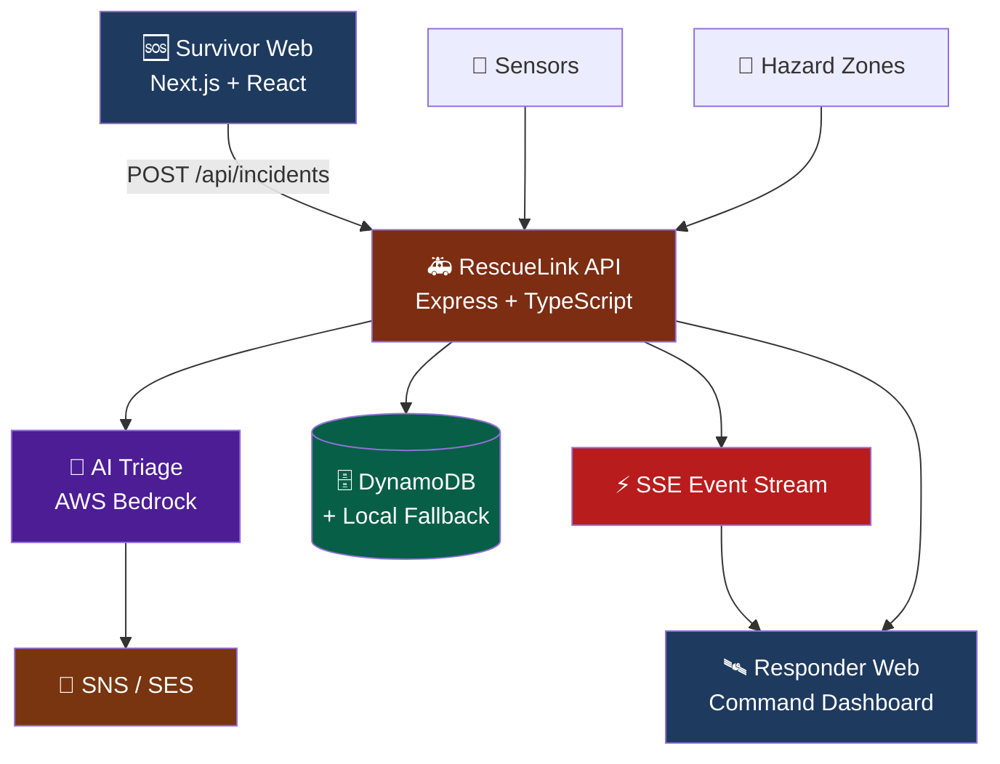

---

## 🧩 Monorepo Structure

```
rescue-link-monorepo/
│
├── apps/
│   ├── api/                    → REST API, SSE, AI triage, DynamoDB, SNS/SES, telemetry
│   ├── responder-web/          → Command dashboard, incident mgmt, maps, dispatch, alerts
│   └── survivor-web/           → SOS submission, voice distress, offline queue, tracking
│
├── packages/
│   ├── schema/                 → Shared Zod contracts
│   └── config/                 → Shared configuration
│
├── tests/
│   └── contract/
│
├── Dev A (Sahil).md
├── Dev B (Anurag).md
├── Dev C (Yash).md
├── package.json
└── package-lock.json
```

---

## ⚙️ Technology Stack

<div align="center">


</div>

| Category | Stack |
|---|---|
| **Frontend** | React 19 • Next.js 15 • TypeScript • Tailwind CSS • Lucide React |
| **Backend** | Node.js • Express • TypeScript • Zod |
| **Mapping** | Leaflet • Leaflet Draw • OpenStreetMap |
| **AI** | AWS Bedrock • Claude 3 Haiku • Heuristic fallback |
| **Storage** | DynamoDB • IndexedDB • In-memory fallback |
| **Realtime** | Server-Sent Events • Polling |
| **Notifications** | Amazon SNS • Amazon SES |
| **Testing** | Vitest • Supertest • Contract tests |
| **DevOps** | npm workspaces • GitHub Actions |

---

## 🚨 Emergency Response Flow

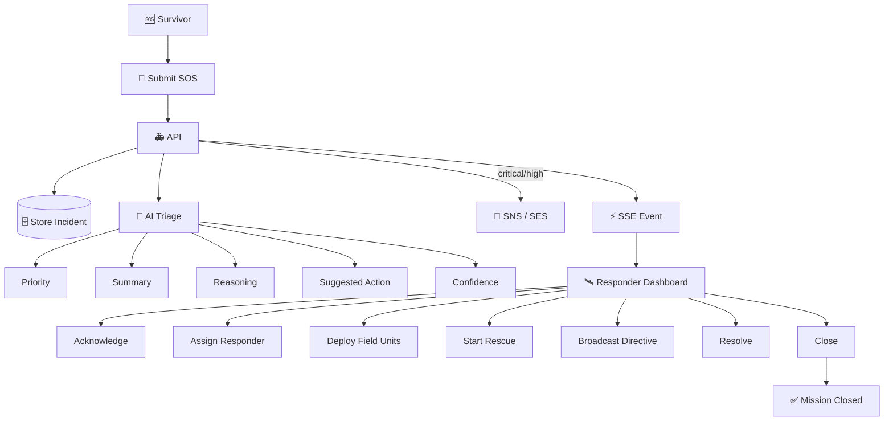

---

## 🔄 Incident Lifecycle

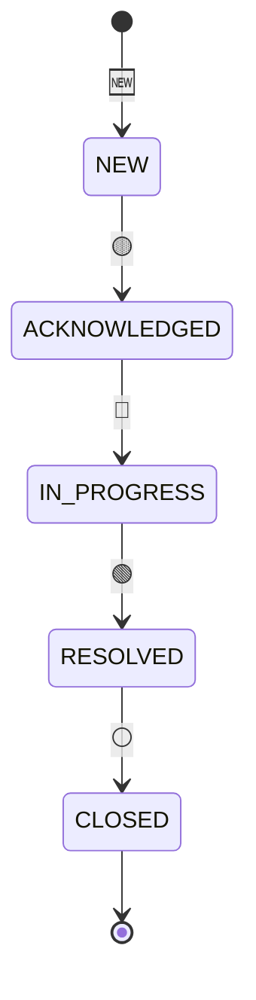

---

## 🛰️ Responder Command Center

**Dashboard**
- Live incident counters
- Active incident view
- Priority / category / status filtering
- Priority-aware sorting
- 15-second polling + SSE live updates + polling fallback
- Offline cache & connection status

**Incident Detail**
- Coordinates, people affected, urgent needs, reporter details
- AI triage summary, reasoning, suggested action, confidence score
- Priority badge, distress audio, assignment
- Field unit deployment, tactical broadcast
- Lifecycle controls, notification status

---

## 🗺️ Map Intelligence

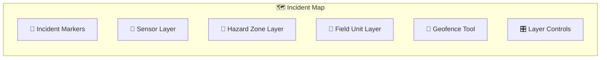

**Features:** priority-based marker styling • sensor telemetry cards • point-in-circle & point-in-polygon checks • bulk incident actions • OpenStreetMap tiles • service-worker tile caching

---

## 🎙️ Voice Distress

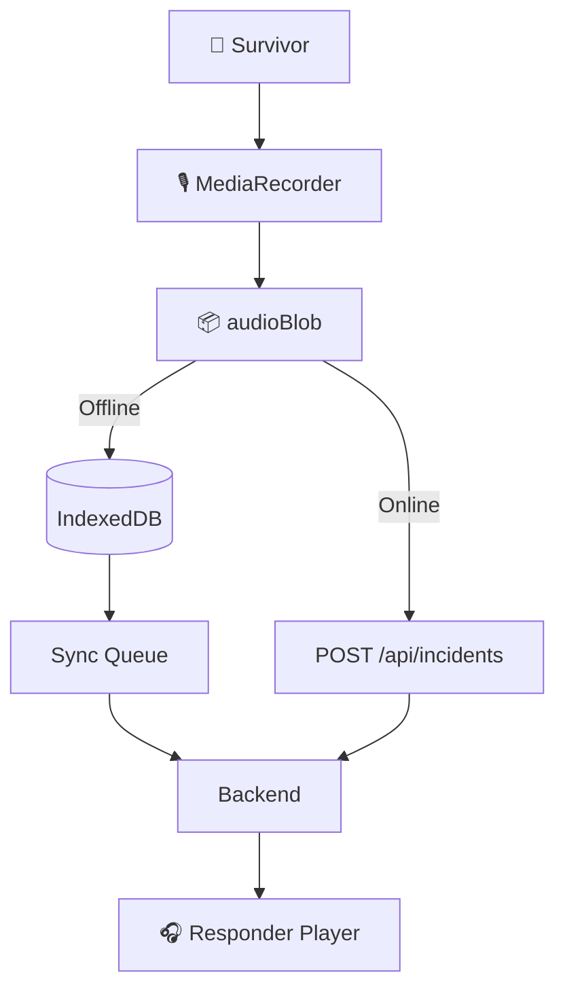

Responder behavior: uses the real `incident.audioBlob` • shows native browser audio controls when audio exists • shows no empty player when audio is absent • preserves the existing backend contract.

---

## 🔔 Critical Alert System

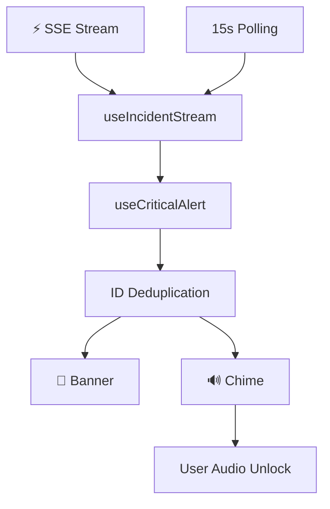

Supports: critical & fire incidents • SSE + polling fallback • duplicate alert prevention • reduced-motion behavior • browser audio restrictions with explicit unlock.

---

## 🧠 AI Triage Pipeline

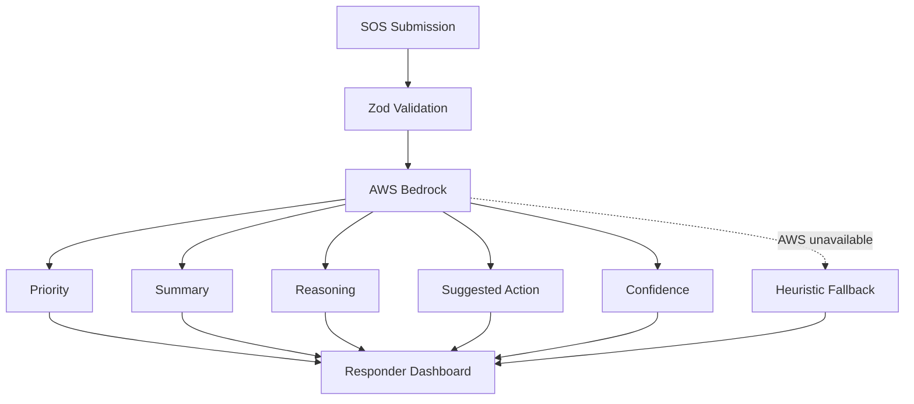

---

## 📡 Realtime + Offline Resilience

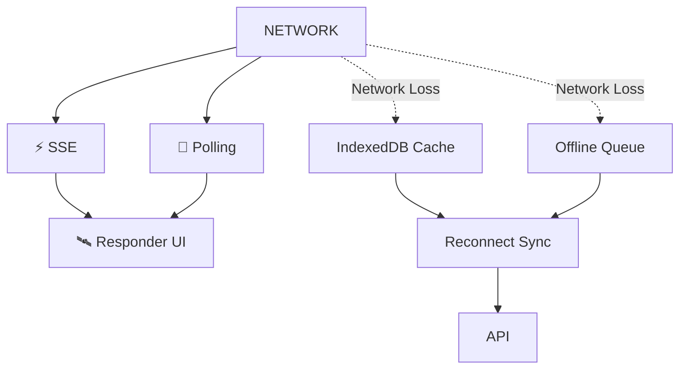

**Survivor resilience:** IndexedDB incident queue • automatic reconnect sync • local incident IDs • offline tracking • battery-aware polling • OLED survival mode • service worker • night beacon • voice distress persistence

**Responder resilience:** IndexedDB incident cache • offline banner • SSE with polling fallback • cached map tiles • offline broadcast outbox • loading/empty/error states

---

## 📣 SNS / SES Notifications

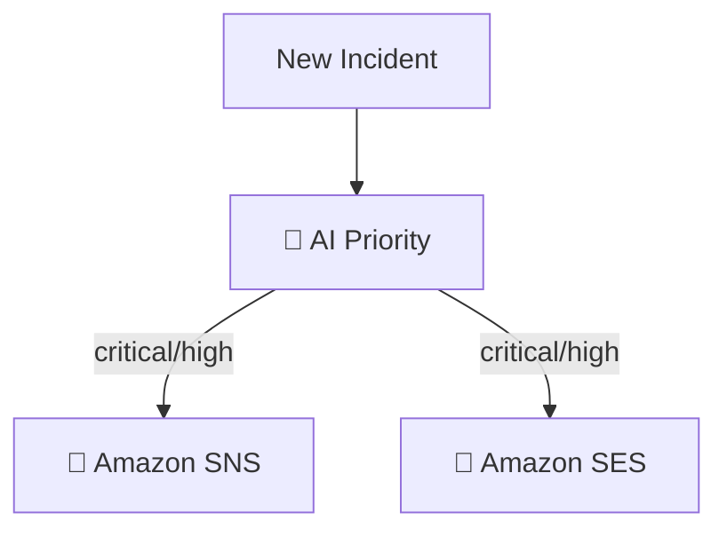

**Test endpoint:** `POST /api/notifications/test`

Responder UI: trigger test notification • loading state • duplicate-click protection • API result reporting • honest delivery status.

> Incident-level SNS/SES delivery fields are not exposed by the incident schema. Local mock mode reports `{ "snsSent": false, "sesSent": false }`. Console logging is **not** treated as AWS delivery.

---

## 🔌 API Surface

| Method | Endpoint | Description |
|---|---|---|
| `POST` | `/api/incidents` | Create incident |
| `GET` | `/api/incidents` | List incidents |
| `GET` | `/api/incidents/:id` | Fetch incident |
| `PATCH` | `/api/incidents/:id` | Update incident |
| `POST` | `/api/incidents/:id/acknowledge` | Acknowledge incident |
| `POST` | `/api/incidents/:id/broadcast` | Tactical broadcast |
| `GET` | `/api/events` | SSE stream |
| `GET` | `/api/sensors` | Sensor telemetry |
| `GET` | `/api/hazard-zones` | Hazard zones |
| `POST` | `/api/notifications/test` | Test notification |
| `GET` | `/api/health` | Health check |

---

## 👥 Developer Ownership

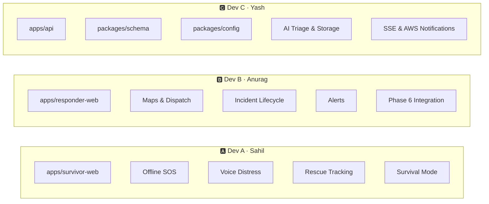

---

## 🧪 Final Verification — QA Gate

| Check | Status |
|---|---|
| TypeScript Typecheck | ✅ PASS |
| Vitest Test Files | ✅ 15 / 15 |
| Vitest Tests | ✅ 98 / 98 |
| Responder Build | ✅ PASS |
| Monorepo Build | ✅ PASS |
| CI | ✅ PASS |
| `git diff --check` | ✅ PASS |
| Working Tree | ✅ CLEAN |
| Final Branch | ✅ PUSHED |

---

## 📊 Test Distribution

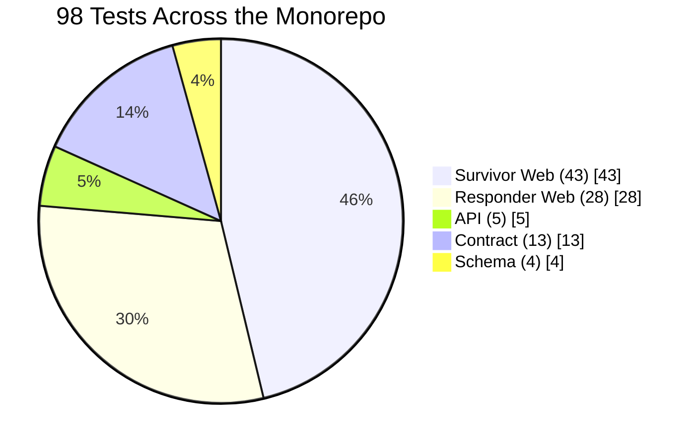

| Module | Suite | Count |
|---|---|---|
| Survivor Web | Offline Queue | 6 |
| Survivor Web | Phase 2 | 6 |
| Survivor Web | Phase 3 | 8 |
| Survivor Web | Phase 4 | 6 |
| Survivor Web | Phase 5 | 17 |
| Responder Web | Lifecycle | 4 |
| Responder Web | Geography | 11 |
| Responder Web | Sorting | 9 |
| Responder Web | Phase 5 Integration | 4 |
| API | Notifications | 2 |
| API | Triage | 3 |
| Contract | Incidents | 13 |
| Schema | Validation | 4 |
| **Total** | | **98 / 98 ✅** |

---

## 📈 Project Status

```mermaid
%%{init: {'theme':'dark'}}%%
gantt
    title RescueLink — Module Completion
    dateFormat  X
    axisFormat %s
    section Core
    Survivor Web            :done, 0, 1
    Responder Web           :done, 0, 1
    API                     :done, 0, 1
    Shared Schema           :done, 0, 1
    section Intelligence
    AI Triage               :done, 0, 1
    DynamoDB Adapter        :done, 0, 1
    SSE                     :done, 0, 1
    Sensors                 :done, 0, 1
    Hazard Zones            :done, 0, 1
    section Comms & Resilience
    SNS / SES               :done, 0, 1
    Offline Support         :done, 0, 1
    Voice Distress          :done, 0, 1
    Critical Alerts         :done, 0, 1
    Incident Lifecycle      :done, 0, 1
    Phase 6 Dev 2           :done, 0, 1
```

---

## 🚀 Local Setup

```bash
# Install dependencies
npm install

# Build shared packages
npm run build:packages

# Typecheck
npm run typecheck

# Run tests
npm test

# Build the responder workspace
npm run build --workspace=@rescue-link/responder-web

# Full build
npm run build

# CI pipeline
npm run ci
```

---

## ▶️ Run Services

| Service | Command | URL |
|---|---|---|
| 🚑 API | `npm run dev:api` | http://localhost:3001 |
| 🆘 Survivor Web | `npm run dev:survivor` | http://localhost:3000 |
| 🛰️ Responder Web | `npm run dev:responder` | http://localhost:3002 |

---

## 🧪 Complete Verification Command

```bash
npm run typecheck && npm test && npm run build --workspace=@rescue-link/responder-web && npm run lint && npm run build && npm run ci && git diff --check
```

---

## 📁 Dev 2 File Structure (Responder Web)

```
apps/responder-web/
│
├── src/
│   ├── app/
│   │   ├── page.tsx
│   │   └── incidents/[id]/page.tsx
│   │
│   ├── components/
│   │   ├── dashboard/
│   │   │   ├── CriticalAlertBanner.tsx
│   │   │   ├── SensorTelemetryPanel.tsx
│   │   │   └── SummaryCards.tsx
│   │   │
│   │   ├── incidents/
│   │   │   ├── DistressAudioPlayer.tsx
│   │   │   ├── NotificationStatus.tsx
│   │   │   ├── IncidentActions.tsx
│   │   │   ├── AssignmentControl.tsx
│   │   │   └── DispatchedUnitsControl.tsx
│   │   │
│   │   └── map/
│   │       ├── IncidentMap.tsx
│   │       ├── IncidentMapClient.tsx
│   │       └── MapLayerControls.tsx
│   │
│   ├── hooks/
│   │   ├── useCriticalAlert.ts
│   │   ├── useHazardLayer.ts
│   │   └── useIncidentStream.ts
│   │
│   └── lib/
│       ├── alertSound.ts
│       ├── api.ts
│       └── dashboardIntegration.ts
│
└── tests/
    ├── phase5.test.ts
    ├── lifecycle.test.ts
    ├── geo.test.ts
    └── sortIncidents.test.ts
```

---

## 🛠️ Phase 6 Dev 2 Deliverables

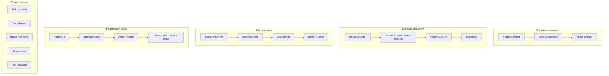

---

## 🔐 Engineering Principles

- ✅ Shared schema remains the contract source
- ✅ Existing functionality is preserved
- ✅ Real backend contracts are used
- ✅ No fake AWS delivery states
- ✅ No fabricated telemetry
- ✅ Offline behavior remains explicit
- ✅ Browser audio restrictions are respected
- ✅ SSE and polling work together
- ✅ Field-unit assignment stays separate from lead responder assignment
- ✅ Graceful fallbacks preserve dashboard operation
- ✅ Automated checks run before delivery

---

## 📚 Documentation

| File | Covers |
|---|---|
| `Dev A (Sahil).md` | Survivor Web implementation and phase history |
| `Dev B (Anurag).md` | Responder Web implementation, Phase 6 integration, verification & handoff |
| `Dev C (Yash).md` | API, shared schema, AWS infrastructure, AI triage, storage, SSE, SNS/SES |

---

## 📌 Final Git State

| Field | Value |
|---|---|
| Branch | `feature/responder-final-phase` |
| Commit | `a44d2b106a46ff73c979c874bb45985f702dc0ac` |
| Status | 🟢 CLEAN |
| Remote | 🟢 PUSHED |
| Verification | 98/98 tests • typecheck ✅ • responder build ✅ • monorepo build ✅ • CI ✅ • `git diff --check` ✅ |

---

<div align="center">

### 🆘 SURVIVOR → 🧠 TRIAGE → 🛰️ DISPATCH → 🚒 RESCUE → ✅ CLOSURE

**RESCUELINK**

[](https://github.com/CyberCodezilla/Rescue-Link)

</div>
