<div align="center">

# 🚨 RESCUE-LINK

## 🛰️ Offline-First Disaster Emergency Response & Tactical AI Command Platform


<br><br>


<br><br>

### 🆘 Life-Saving Infrastructure For Disasters, Floods, Earthquakes & Network Blackouts


</div>

---

# 🌐 Live System

| Service | Link | Status |
|---|---|---|
| 🧍 Survivor Emergency Portal | https://survivor.rescuelink.org | 🟢 Online |
| 🚒 Tactical Responder HUD | https://rescuer.rescuelink.org | 🟢 Online |
| 📚 Documentation | docs/ | 📖 Available |
| ☁️ Cloud Infrastructure | AWS Serverless Stack | 🟢 Healthy |

---

# ⚡ Mission Overview

Rescue-Link is an offline-first disaster communication system connecting trapped survivors with emergency responders during infrastructure failures.

The platform combines:

- Progressive Web Apps
- Offline IndexedDB Queues
- AI Emergency Triage
- AWS Lambda Workflows
- Satellite / IoT Telemetry
- Real-Time Tactical Dashboards
- Disaster Alert Broadcasting

---

# 🧬 System Flow Animation

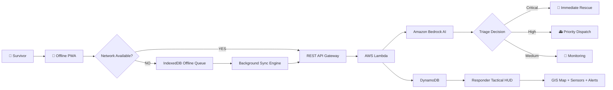

---

# 🏗️ Enterprise Architecture

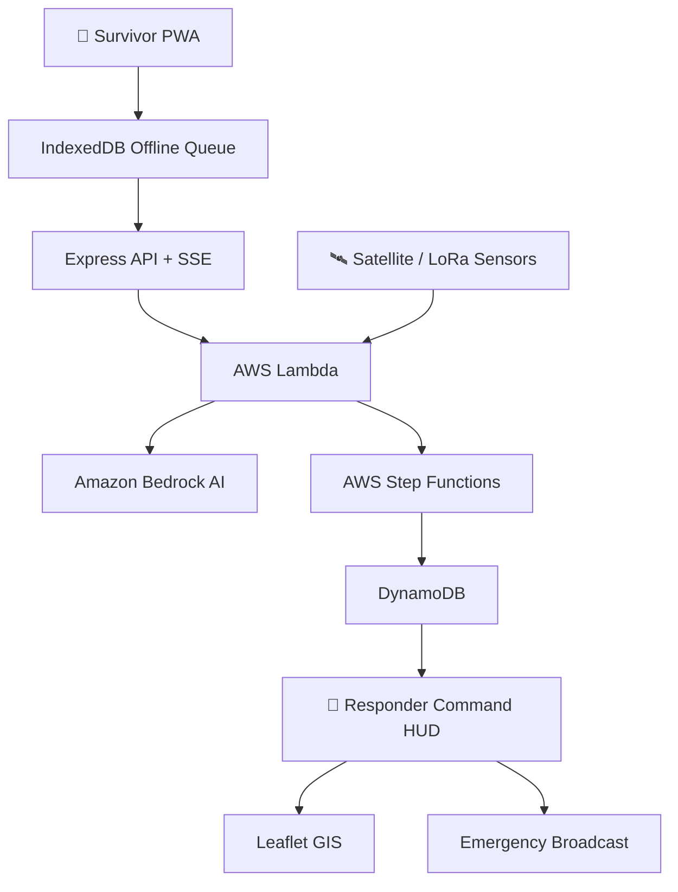

---

# 🔄 End-to-End Sequence Diagram

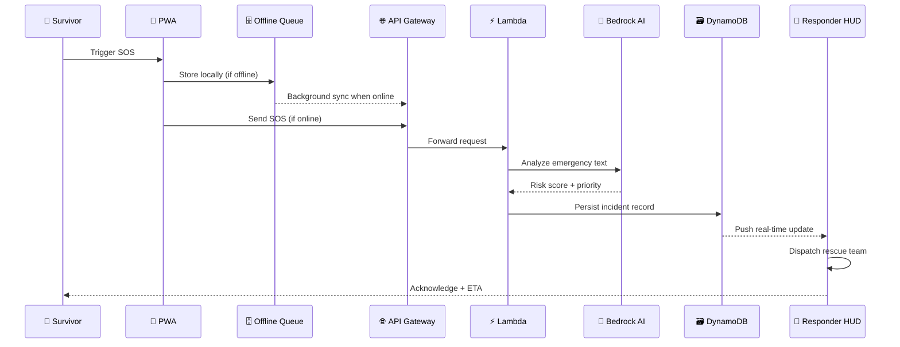

---

# 🚨 Survivor Portal Features


## Offline Emergency Mode

* Works without internet
* Stores SOS locally
* Automatic sync recovery
* Background retry workers

## Emergency Beacon

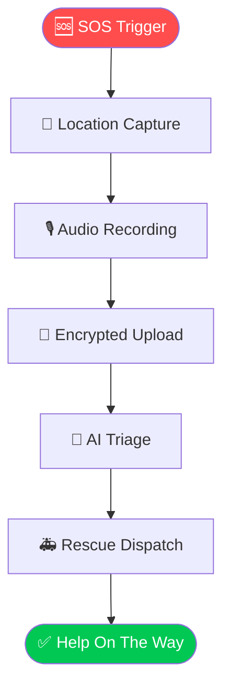

## Survivor Lifecycle

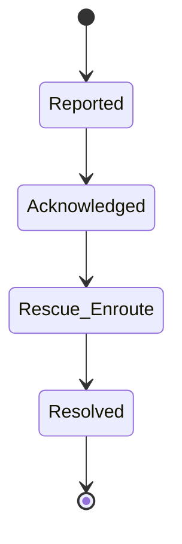

---

# 🧠 AI Emergency Intelligence Engine

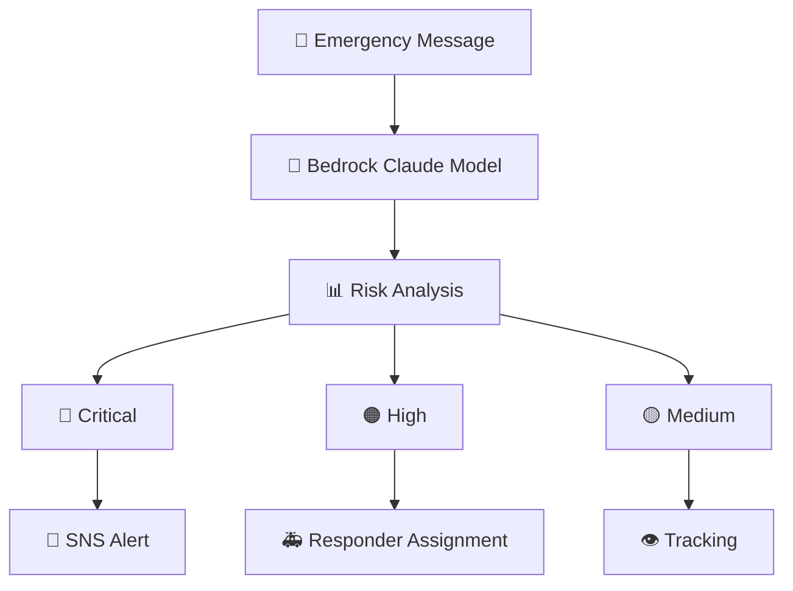

## AI Capabilities

| Feature                | Status |
| ---------------------- | ------ |
| Disaster Text Analysis | ✅      |
| Priority Detection     | ✅      |
| Confidence Score       | ✅      |
| AI Failure Backup      | ✅      |
| Audit Logging          | ✅      |

## AI Triage Confidence Distribution

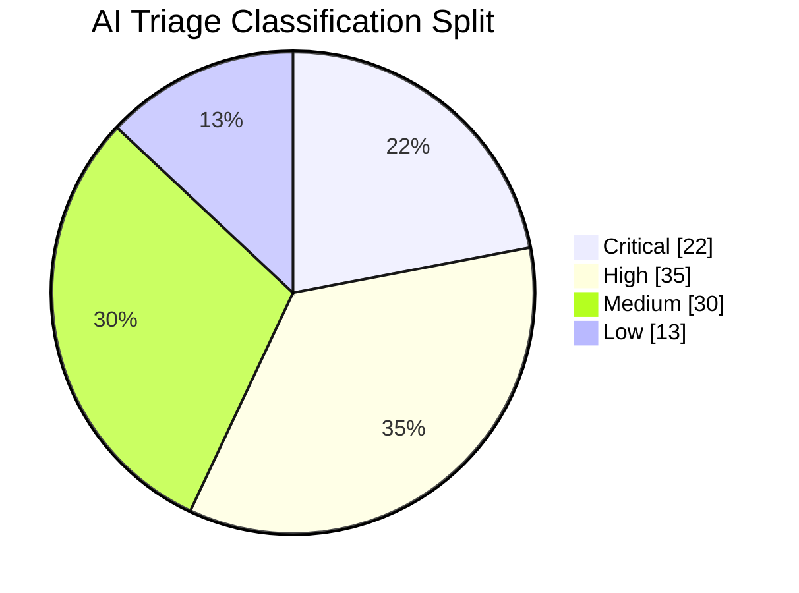

---

# 🛰️ Satellite & Sensor Network

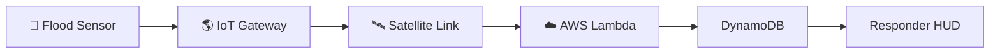

Sensor Monitoring:

🌊 Water Level
🌎 Earthquake Activity
🎙 Acoustic Distress
🌫 Air Quality
📡 Signal Strength


---

# 🚒 Tactical Responder HUD


Features:

* Real-time incident map
* Rescue team tracking
* Priority filters
* Sensor monitoring
* Emergency broadcasting
* Audio directives

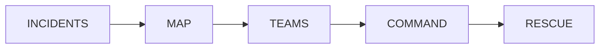

---

# 📊 System Performance Dashboard

INCIDENT PROCESSING

SOS Received
████████████████ 100%

AI Classification
██████████████ 90%

Responder Dispatch
████████████ 80%

Resolution Tracking
███████████ 75%

RELIABILITY METRICS

Offline Support ██████████ 100%

AI Fallback ██████████ 100%

Data Persistence ██████████ 100%

Security Validation ██████████ 100%


## 📈 Incident Volume Trend (Last 7 Days)

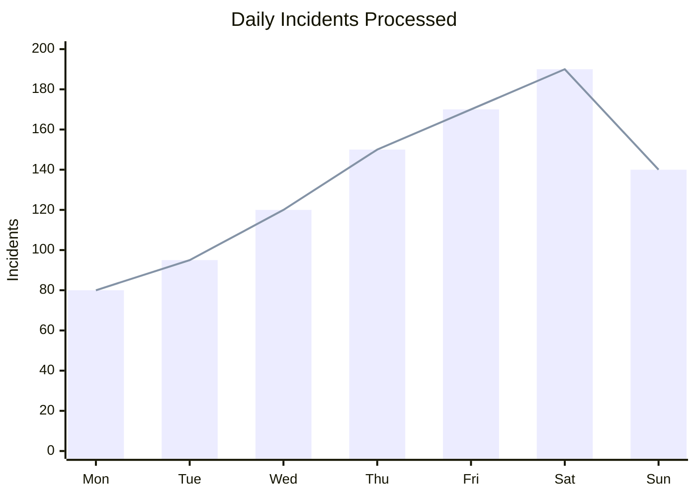

## ⏱️ Average Response Time by Priority (min)

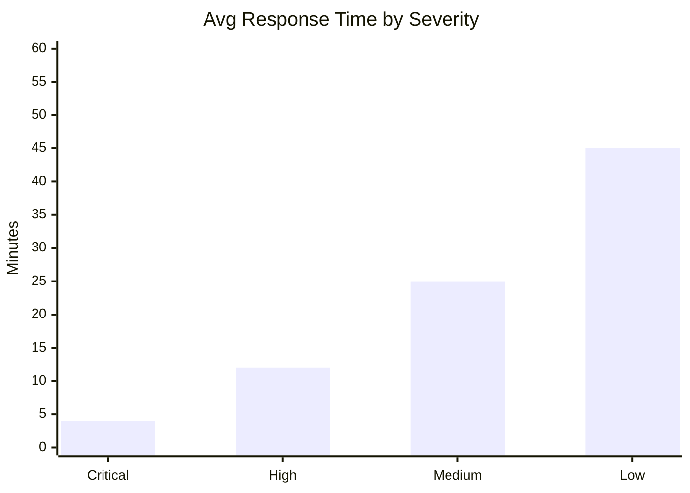

## 🗓️ Development Roadmap

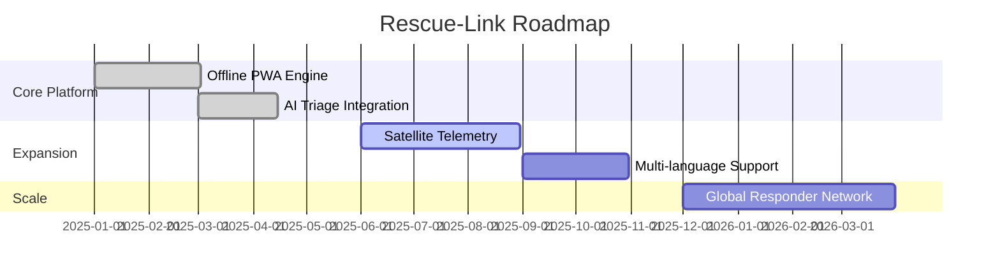

---

# 🔐 Security Architecture

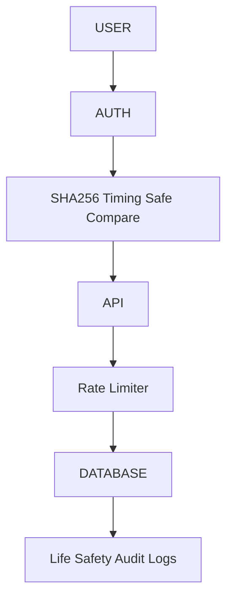

Security:

* Constant-time authentication
* Rate limited SOS endpoints
* Encrypted communication
* Production environment validation
* Audit trace system

## 🛡️ Threat Response Model

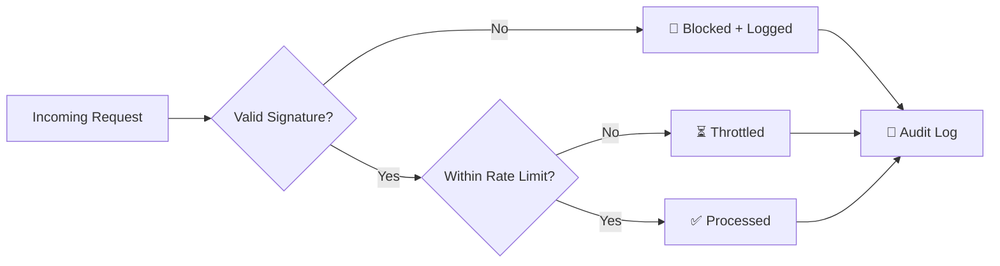

---

# 📂 Repository Structure

Rescue-Link/

├── apps/
│ ├── api/
│ ├── lambda/
│ ├── responder-web/
│ └── survivor-web/

├── packages/
│ ├── config/
│ └── schema/

├── docs/

├── template.yaml

└── package.json


---

# ☁️ AWS Infrastructure

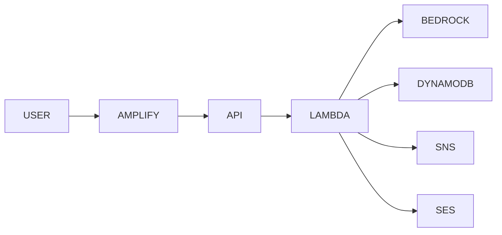

Services:

* AWS Amplify
* AWS Lambda
* Amazon Bedrock
* DynamoDB
* SNS
* SES
* Step Functions
* IoT Telemetry

---

# 🛠️ Local Setup

```bash
git clone https://github.com/CyberCodezilla/Rescue-Link.git

cd Rescue-Link

npm ci

npm run build:packages

npm run dev
```

Ports:

Survivor Portal : 3000

API Server : 3001

Responder HUD : 3002


---

# 🧪 Testing

```bash
npm test

npm run typecheck

npm run build
```

Current:

139 Tests Passing
0 TypeScript Errors
Production Build Successful


---

# 🔥 Why Rescue-Link?

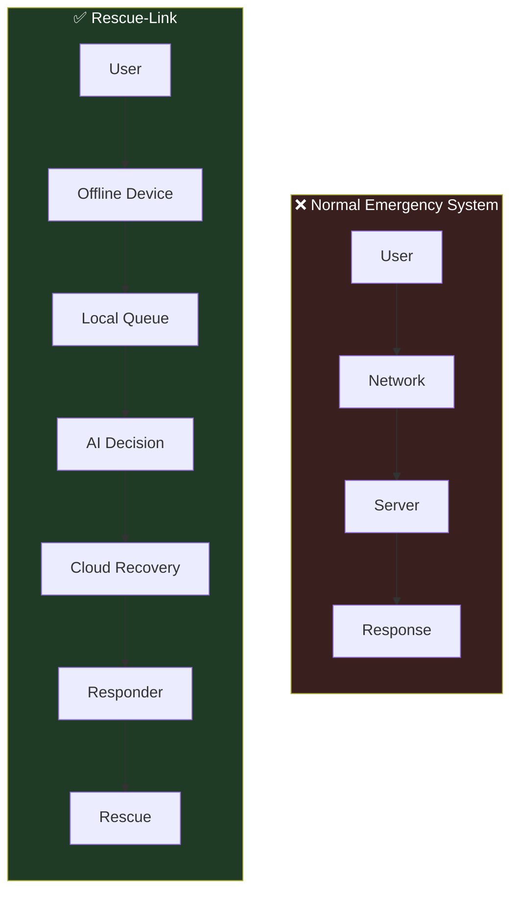

---

<div align="center">

# 🚨 RESCUE-LINK

## Built For The Moment When Everything Else Fails

🛰️ Offline Ready&nbsp;&nbsp;|&nbsp;&nbsp;🤖 AI Assisted&nbsp;&nbsp;|&nbsp;&nbsp;🚒 Rescue Focused&nbsp;&nbsp;|&nbsp;&nbsp;🌎 Disaster Resilient

<br>


<br><br>


</div>
