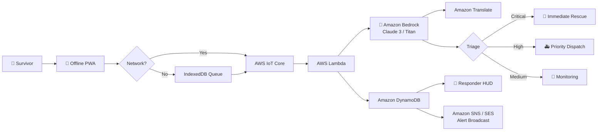
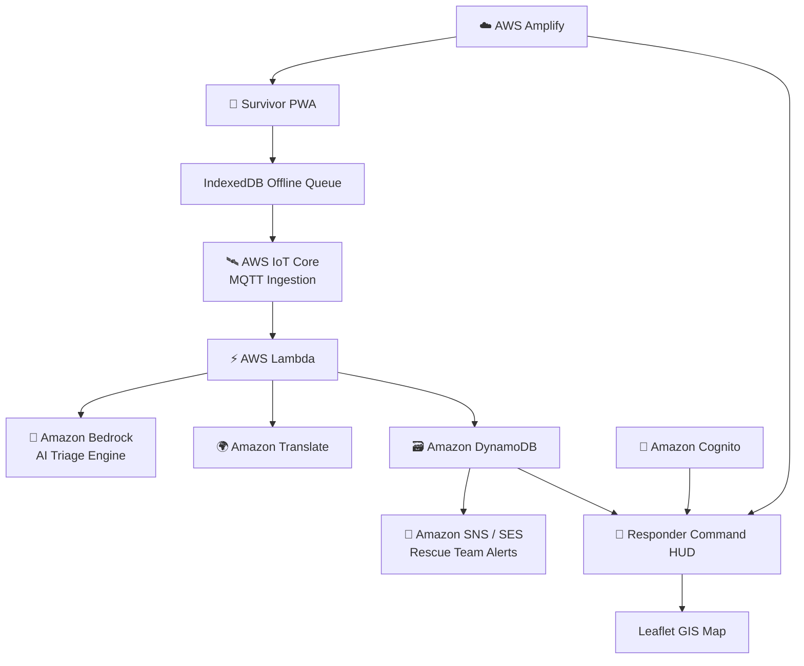
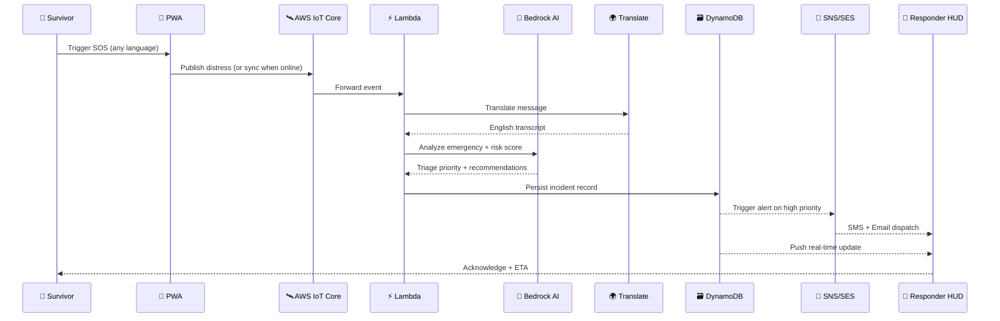

```
██████╗ ███████╗███████╗ ██████╗██╗   ██╗███████╗    ██╗     ██╗███╗   ██╗██╗  ██╗
██╔══██╗██╔════╝██╔════╝██╔════╝██║   ██║██╔════╝    ██║     ██║████╗  ██║██║ ██╔╝
██████╔╝█████╗  ███████╗██║     ██║   ██║█████╗      ██║     ██║██╔██╗ ██║█████╔╝ 
██╔══██╗██╔══╝  ╚════██║██║     ██║   ██║██╔══╝      ██║     ██║██║╚██╗██║██╔═██╗ 
██║  ██║███████╗███████║╚██████╗╚██████╔╝███████╗    ███████╗██║██║ ╚████║██║  ██╗
╚═╝  ╚═╝╚══════╝╚══════╝ ╚═════╝ ╚═════╝ ╚══════╝    ╚══════╝╚═╝╚═╝  ╚═══╝╚═╝  ╚═╝
```

<div align="center">

### 🚨 Offline-First Disaster Emergency Response & Tactical AI Command Platform


<br>

<br>

🆘 *Life-saving infrastructure for disasters, floods, earthquakes & network blackouts*
🏆 *Built on AWS — Serverless, AI-Native, Mission Critical*


</div>

---

## 🌐 Live System

| Service | Link | Status |
|---|---|---|
| 🧍 Survivor Emergency Portal | https://survivor.rescuelink.org | 🟢 Online |
| 🚒 Tactical Responder HUD | https://rescuer.rescuelink.org | 🟢 Online |
| 📚 Documentation | `docs/` | 📖 Available |
| ☁️ Cloud Infrastructure | AWS Serverless Stack | 🟢 Healthy |

---

## ⚡ Mission Overview

**Rescue-Link** is an offline-first disaster communication system connecting trapped survivors with emergency responders during infrastructure failures — powered end-to-end by **AWS**, combining Progressive Web Apps, offline queues, AI-driven triage, and real-time tactical dashboards.

---

<div align="center">

## ☁️ POWERED BY AWS


</div>

### 🧠 Key AWS Services Leveraged

| AWS Service | Role in Rescue-Link |
|---|---|
| 🛰️ **AWS IoT Core** | Ultra-low-bandwidth MQTT distress ingestion with offline-first client buffering for blacked-out networks |
| 🧠 **Amazon Bedrock** (Claude 3 / Titan) | Autonomous medical & hazard triage, casualty extraction, priority classification, and gear recommendations |
| 🌍 **Amazon Translate** | Instant translation of survivor distress messages from any language into English, while archiving original source transcripts |
| 🗃️ **Amazon DynamoDB** | Single-digit millisecond latency persistence for active incidents, geospatial coordinates, and responder audits |
| 📣 **Amazon SNS & SES** | Immediate broadcast dispatch of high-priority mission alerts via SMS and email to field rescue teams |
| 🔐 **AWS Amplify & Amazon Cognito** | Serverless, high-availability global hosting with tactical role-based authentication for emergency personnel |

---

## 🧬 Core Flow



## 🏗️ System Architecture



## 🔄 SOS Request Sequence



---

## ☁️ Full AWS Services Stack

<div align="center">


</div>

| # | Service | Purpose |
|---|---|---|
| 1 | Amazon Translate | Multi-language survivor support |
| 2 | Amazon Bedrock | AI emergency triage & risk scoring |
| 3 | Amazon DynamoDB | Incident & responder data store |
| 4 | Amazon EC2 | Backend compute workloads |
| 5 | AWS Amplify | Frontend hosting & CI/CD |
| 6 | Amazon Cognito | Responder/survivor authentication |
| 7 | AWS Lambda | Serverless request processing |
| 8 | AWS Step Functions | Incident workflow orchestration |
| 9 | Amazon SNS | Critical alert broadcasting |
| 10 | Amazon SES | Email notifications |
| 11 | AWS IoT Core | Satellite/sensor telemetry ingestion |
| 12 | AWS IAM | Access control & permissions |
| 13 | AWS SAM / CloudFormation | Infrastructure as code |
| 14 | Amazon CloudWatch | Logging, metrics & alarms |

---

## 🚨 Survivor Portal Features

- 📴 Offline emergency mode — works with zero connectivity
- 🗄️ Local SOS storage with automatic background sync
- 📍 Location capture + 🎙️ audio recording on trigger
- 🌍 Auto-translated distress messages (Amazon Translate)
- 🔐 Encrypted upload → 🧠 AI triage → 🚑 dispatch

## 🚒 Tactical Responder HUD

- 🗺️ Real-time incident map (Leaflet GIS)
- 👥 Rescue team tracking & priority filters
- 📡 Live sensor monitoring (flood, seismic, acoustic, air quality, signal)
- 📣 Emergency broadcast & audio directives

## 🧠 AI Emergency Intelligence (Amazon Bedrock)

| Feature | Status |
|---|---|
| Disaster Text Analysis | ✅ |
| Priority / Hazard Classification | ✅ |
| Casualty Extraction | ✅ |
| Gear Recommendations | ✅ |
| Confidence Scoring | ✅ |
| AI Failure Backup | ✅ |
| Audit Logging | ✅ |

## 🔐 Security

- Amazon Cognito role-based authentication for emergency personnel
- Constant-time (SHA256) authentication
- Rate-limited SOS endpoints
- Encrypted communication end-to-end
- Production environment validation
- Full audit trace system

---

## 📂 Repository Structure

```
Rescue-Link/
├── apps/
│   ├── api/
│   ├── lambda/
│   ├── responder-web/
│   └── survivor-web/
├── packages/
│   ├── config/
│   └── schema/
├── docs/
├── template.yaml
└── package.json
```

---

## 🛠️ Local Setup

```bash
git clone https://github.com/CyberCodezilla/Rescue-Link.git
cd Rescue-Link
npm ci
npm run build:packages
npm run dev
```

| Service | Port |
|---|---|
| Survivor Portal | 3000 |
| API Server | 3001 |
| Responder HUD | 3002 |

## 🧪 Testing

```bash
npm test
npm run typecheck
npm run build
```

✅ 139 Tests Passing · ✅ 0 TypeScript Errors · ✅ Production Build Successful

---

<div align="center">

```
██████╗ ███████╗███████╗ ██████╗██╗   ██╗███████╗    ██╗     ██╗███╗   ██╗██╗  ██╗
██╔══██╗██╔════╝██╔════╝██╔════╝██║   ██║██╔════╝    ██║     ██║████╗  ██║██║ ██╔╝
██████╔╝█████╗  ███████╗██║     ██║   ██║█████╗      ██║     ██║██╔██╗ ██║█████╔╝ 
██╔══██╗██╔══╝  ╚════██║██║     ██║   ██║██╔══╝      ██║     ██║██║╚██╗██║██╔═██╗ 
██║  ██║███████╗███████║╚██████╗╚██████╔╝███████╗    ███████╗██║██║ ╚████║██║  ██╗
╚═╝  ╚═╝╚══════╝╚══════╝ ╚═════╝ ╚═════╝ ╚══════╝    ╚══════╝╚═╝╚═╝  ╚═══╝╚═╝  ╚═╝
```

**Built for the moment when everything else fails**

🛰️ Offline Ready · 🤖 AI Assisted · 🚒 Rescue Focused · 🌎 Disaster Resilient · ☁️ AWS Powered


</div>
